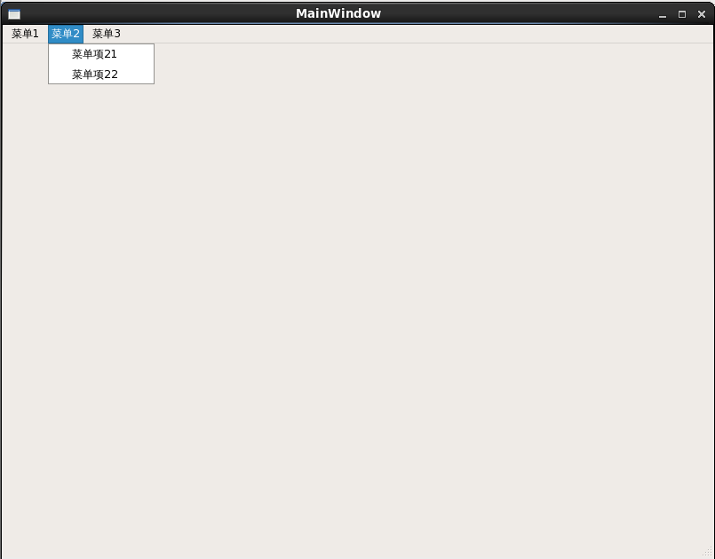
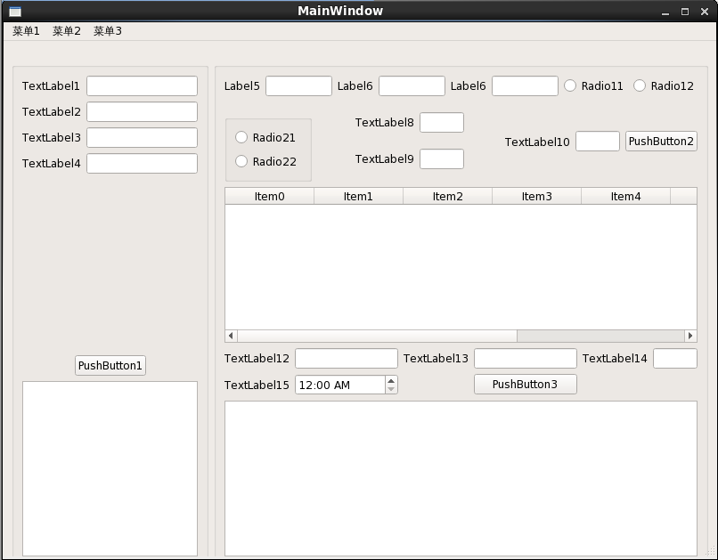
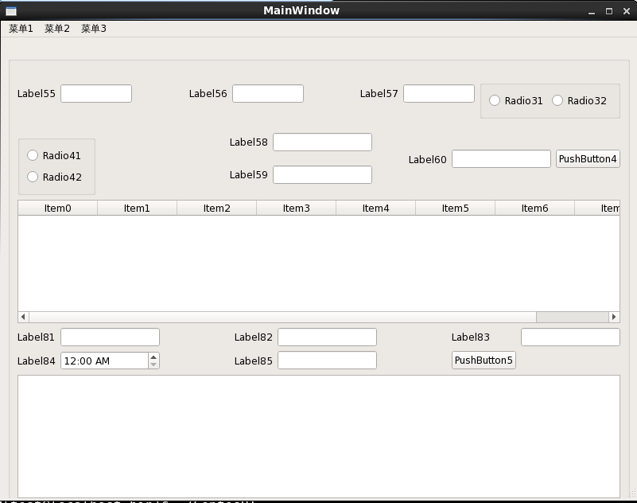
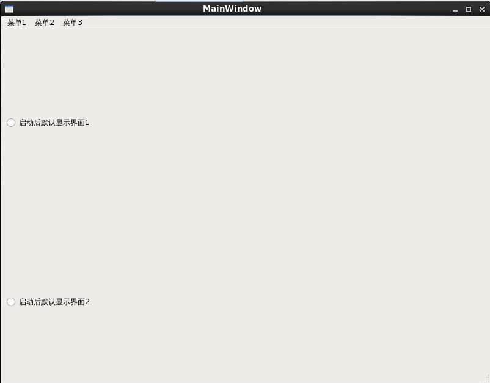

#SimpleQTCentOSUI
## 





## 说明
- 窗口默认大小为800 x 600，同时最小也是800 x 600
- 窗口内容可随窗口大小自适应
- 开发最终的程序可在非安装Qt的目标环境运行

## 菜单
       
- 菜单项11，点击后退出程序
- 菜单项21，点击后显示界面一
- 菜单项22，点击后显示界面二
- 菜单项31，点击后显示界面三


##设置GLIBC目录
如果按默认方式安装gcc4.9+版本，新的GLIBC将会安装在/usr/local/lib64中，而老的在在/usr/lib64中。因此需要修改LD_LIBRARY_PATH  
```
vim ~/.bashrc
export LD_LIBRARY_PATH=/usr/local/lib64:$LD_LIBRARY_PATH
```
## 把ldd查询到的所有需要的库导出
这里提供一个脚本将ldd打印出来的依赖库复制到指定路径：
```sh
#!/bin/sh  
  
exe="CentosUI" #发布的程序名称  
des="/home/test/SimpleQTCentOSUI/dependlib" #你的路径  
  
deplist=$(ldd $exe | awk  '{if (match($3,"/")){ printf("%s "),$3 } }')  
cp $deplist $des  
```
说明：exe ：要发布的程序名称 des：指定复制的路径 

##编写启动脚本
编写.sh文档 并将它放在与上步骤同一目录下（.sh文件命名必须与可执行文件名字一样例：可执行文件名 CentosUI， .sh 文件名为 CentosUI.sh）
.sh文件代码如下：

```sh
#!/bin/sh  
appname=`basename $0 | sed s,\.sh$,,`  
  
dirname=`dirname $0`  
tmp="${dirname#?}"  
  
if [ "${dirname%$tmp}" != "/" ]; then  
dirname=$PWD/$dirname  
fi  
LD_LIBRARY_PATH=$dirname  
export LD_LIBRARY_PATH  
$dirname/$appname "$@"  
```
执行这个.sh文件：
可能因为不行执行需更改权限：
chmod +x CentosUI.sh
